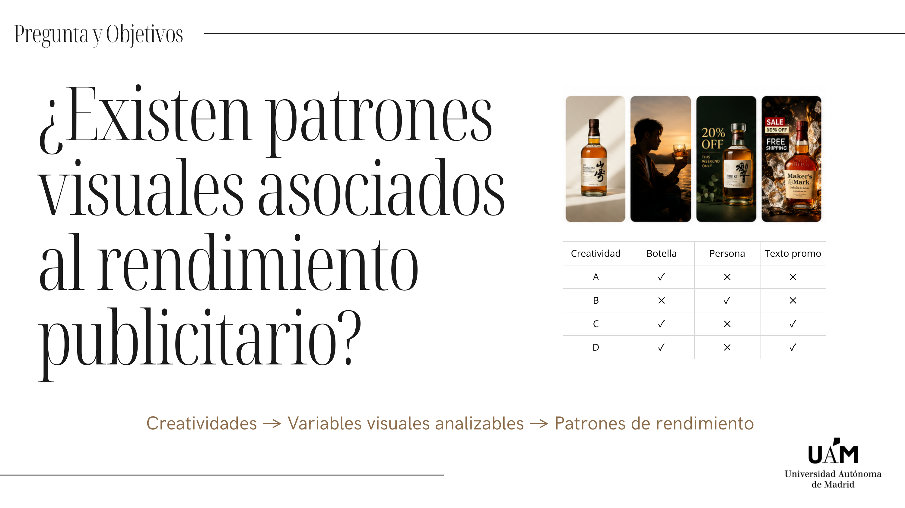
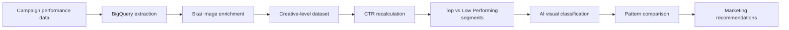
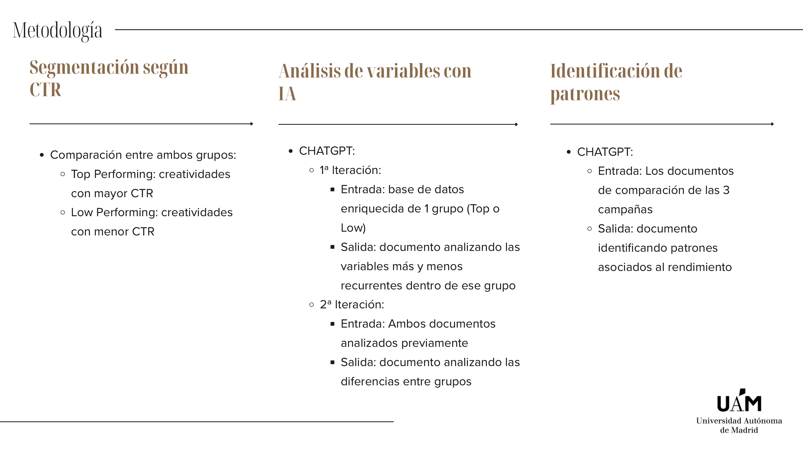
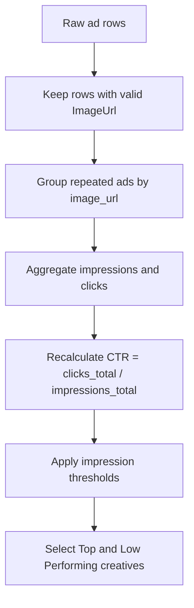
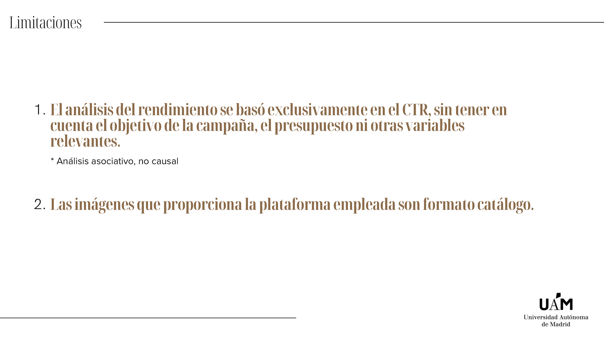
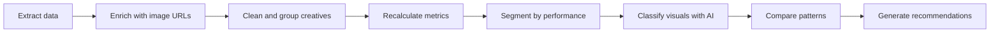

# Spirits AI Creative Analysis


**Final Degree Project:** *Analysis of advertising creatives in spirits through AI*  
**Degree:** Business Analytics  
**Author:** Ana Belen Garcia Caamano


## Project In One Sentence

This project explores whether visual characteristics in digital advertising creatives are associated with higher or lower campaign performance in the US spirits market, using real campaign data, Skai enrichment, BigQuery validation, and AI-assisted image analysis.

## Why This Project Matters

Creative performance is often evaluated manually or through subjective marketing judgement. This project shows how creative assets can be transformed into structured analytical variables, allowing marketing teams to compare top- and low-performing ads through a data-driven lens.

| Business question | Analytical approach |
| --- | --- |
| Which visual patterns are linked to stronger CTR? | Compare Top vs Low Performing creatives |
| Are some visual patterns repeated across commercial periods? | Analyze Super Bowl, Black Friday / Cyber Monday, and Christmas separately |
| Can AI scale creative review? | Convert image content into structured variables |
| Can the process be made reproducible? | Use Codex skills for extraction, enrichment, validation, and dataset preparation |

## Research Question

> Are there visual patterns associated with advertising performance in digital spirits campaigns?



The project focused on turning creative assets into analyzable variables such as:

- product presence,
- bottle or serve format,
- visual composition,
- visual complexity,
- promotional text,
- branding visibility,
- human presence,
- seasonal or premium visual codes.

## Methodology




The updated presentation separates the methodology into two layers:

| Layer | What happened |
| --- | --- |
| Data extraction through Codex | BigQuery was used to work with real 2025 campaign performance data, while Skai provided the creative image URLs needed for visual analysis |
| Visual analysis through ChatGPT | Image URLs were processed with AI and converted into structured variables such as composition, bottle presence, complexity, promotional text, and visual hierarchy |



## Data Pipeline

The project combined three technical workflows:

| Step | Purpose | Related repository |
| --- | --- | --- |
| 1. Warehouse exploration | Extract and validate campaign performance metrics such as impressions, clicks, and CTR | [bigquery-skill](https://github.com/anabelengarciac/bigquery-skill) |
| 2. Creative image enrichment | Map `AdId -> ImageUrl` using Skai so each ad could be connected to its visual creative | [spirits-creative-image-enrichment](https://github.com/anabelengarciac/spirits-creative-image-enrichment) |
| 3. Performance dataset preparation | Export, organize, filter, compare periods, and quality-check Skai performance data | [spirits-creative-performance-ai](https://github.com/anabelengarciac/spirits-creative-performance-ai) |

## Commercial Periods

The analysis focused on three high-activity commercial moments in the US market:

| Period | Date window used in the project | Why it matters |
| --- | --- | --- |
| Super Bowl | January 9 - February 9, 2025 | High attention, brand competition, strong creative pressure |
| Black Friday / Cyber Monday | November 1 - November 30, 2025 | Promotion-heavy environment with commercial overlays |
| Christmas | December 1 - December 31, 2025 | Seasonal messaging, gifting cues, and premium visual codes |

## Dataset Logic

The final analytical dataset was prepared at creative level rather than raw ad level.



This mattered because a single creative image could be reused across multiple ads. Grouping by image helped avoid duplicated visual observations and made the performance comparison more meaningful.

## What AI Added

AI was used to turn qualitative creative elements into structured variables. Instead of manually reviewing every image, the workflow classified creatives into predefined categories and enabled systematic comparison between performance groups.

Examples of extracted visual variables:

| Dimension | Example variables |
| --- | --- |
| Product presentation | `has_bottle`, `packaging_type`, `creative_format` |
| Composition | `composition_type`, `visual_complexity_score` |
| Branding | `logo_visibility`, brand presence |
| Commercial messaging | `retail_overlay_present`, `promotion_badge_present`, `cta_text_present` |
| Context | human presence, seasonality, premium codes |

## AI Analysis Iterations

The analysis was structured in two AI-assisted iterations:

| Iteration | Input | Output |
| --- | --- | --- |
| 1. Within-group analysis | Enriched dataset for one group, either Top Performing or Low Performing | Document identifying the most and least recurrent visual variables within that group |
| 2. Cross-group comparison | The two previous analysis documents | Document comparing the differences between Top and Low Performing creatives |

This design made the analysis more traceable: each conclusion could be connected back to a defined group, a defined visual variable set, and a documented comparison step.

## Key Findings

| Top Performing creatives tended to show | Low Performing creatives tended to show |
| --- | --- |
| More differentiated structures | More repetitive structures |
| Clearer visual hierarchy | More competing visual elements |
| Cleaner composition | Higher visual saturation |
| More dynamic layouts | More centered and conventional compositions |

The public repository intentionally summarizes these results in text rather than publishing the original creative examples. The updated presentation contains real brand visuals used for academic defense, but they are excluded here to keep the GitHub version focused on process rather than proprietary campaign assets.

## Limitations



The project should be read as an exploratory creative analytics methodology, not as a causal performance model:

- Performance was evaluated through CTR only.
- Campaign objective, budget, audience, placement, and other media variables were outside the final model.
- The available creative images came from platform catalog-style formats, which can constrain the visual interpretation.
- Results identify associations and hypotheses for creative learning, not definitive proof that a specific visual element caused performance.

## Main Conclusion


The most important conclusion is methodological: **the creative analysis process can be automated, documented, and reproduced**.

Instead of treating creative review as a one-off manual exercise, the project turns it into a repeatable pipeline:



### Core Conclusions

| Conclusion | Why it matters |
| --- | --- |
| The process can be automated and reproduced | The same workflow can be rerun for new periods, markets, brands, or campaigns with consistent logic |
| AI can structure creative judgement | Visual elements such as composition, bottle presence, promotional text, and complexity can become analyzable variables |
| Creative analysis can scale beyond manual review | Teams can inspect many more ads without relying only on subjective creative evaluation |
| Performance and creativity can be connected | CTR, impressions, and clicks can be compared with structured visual features |
| The method supports learning, not causal proof | Results identify associations and hypotheses for creative strategy, not definitive causal effects |

### Main Takeaway

The project shows that advertising creativity can be analyzed through a data-driven methodology. AI does not replace creative judgement, but it can make the review process more scalable, traceable, and consistent.

For marketing teams, the key value is not only discovering which visual patterns appeared in this dataset. The bigger value is having a **reusable analytical system** that can be applied again when new campaigns launch, new periods need to be reviewed, or creative learnings need to be compared across markets.

Read more in [docs/conclusions.md](docs/conclusions.md).

## Repository Map

```text
.
|-- README.md
|-- assets/
|   `-- slides/
|       |-- analysis-methodology.png
|       |-- conclusions.png
|       |-- limitations.png
|       |-- methodology.png
|       |-- research-question.png
|       |-- title.png
`-- docs/
    |-- conclusions.md
    `-- methodology.md
```

## Skills Demonstrated

`Business Analytics` - `creative analytics` - `performance marketing` - `BigQuery` - `Skai API` - `AI image analysis` - `data enrichment` - `metric validation` - `research storytelling`

## Notes

This repository is a public portfolio explanation of the project. It does not include private datasets, credentials, raw campaign exports, proprietary image URLs, original creative examples, or confidential brand-level results.
