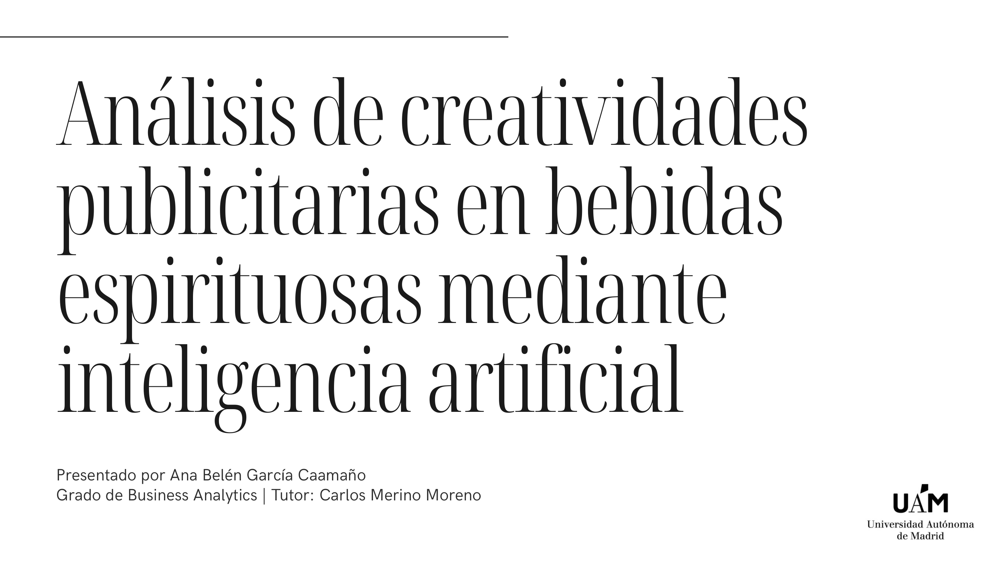
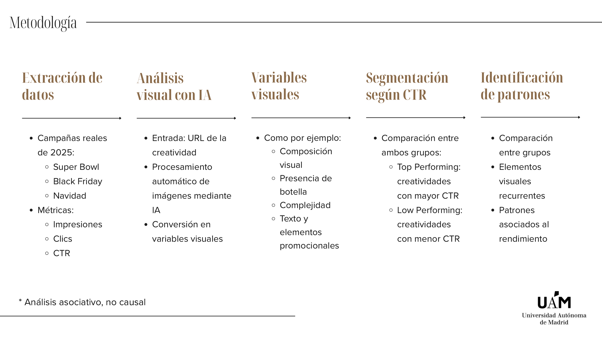
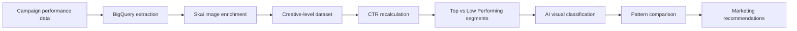
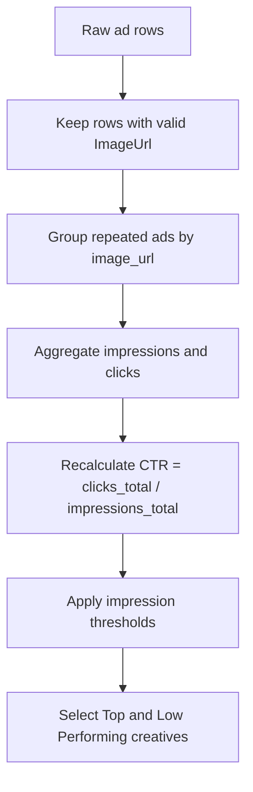
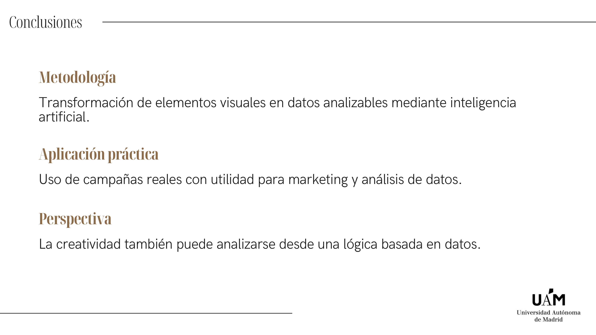

# Spirits AI Creative Analysis


**Final Degree Project:** *Analysis of advertising creatives in spirits through AI*  
**Degree:** Business Analytics  
**Author:** Ana Belen Garcia Caamano



## Project In One Sentence

This project explores whether visual characteristics in digital advertising creatives are associated with higher or lower campaign performance in the US spirits market, using real campaign data, Skai enrichment, BigQuery validation, and AI-assisted image analysis.

## Why This Project Matters

Creative performance is often evaluated manually or through subjective marketing judgement. This project shows how creative assets can be transformed into structured analytical variables, allowing marketing teams to compare top- and low-performing ads through a data-driven lens.

| Business question | Analytical approach |
| --- | --- |
| Which visual patterns are linked to stronger CTR? | Compare Top vs Low Performing creatives |
| Are some visual patterns repeated across commercial periods? | Analyze Super Bowl, Black Friday / Cyber Monday, and Christmas separately |
| Can AI scale creative review? | Convert image content into structured variables |
| Can the process be made reproducible? | Use Codex skills for extraction, enrichment, validation, and dataset preparation |

## Research Question

> Are there visual patterns associated with advertising performance in digital spirits campaigns?

The project focused on turning creative assets into analyzable variables such as:

- product presence,
- bottle or serve format,
- visual composition,
- visual complexity,
- promotional text,
- branding visibility,
- human presence,
- seasonal or premium visual codes.

## Methodology





## Data Pipeline

The project combined three technical workflows:

| Step | Purpose | Related repository |
| --- | --- | --- |
| 1. Warehouse exploration | Extract and validate campaign performance metrics such as impressions, clicks, and CTR | [bigquery-skill](https://github.com/anabelengarciac/bigquery-skill) |
| 2. Creative image enrichment | Map `AdId -> ImageUrl` using Skai so each ad could be connected to its visual creative | [spirits-creative-image-enrichment](https://github.com/anabelengarciac/spirits-creative-image-enrichment) |
| 3. Performance dataset preparation | Export, organize, filter, compare periods, and quality-check Skai performance data | [spirits-creative-performance-ai](https://github.com/anabelengarciac/spirits-creative-performance-ai) |

## Commercial Periods

The analysis focused on three high-activity commercial moments in the US market:

| Period | Why it matters |
| --- | --- |
| Super Bowl | High attention, brand competition, strong creative pressure |
| Black Friday / Cyber Monday | Promotion-heavy environment with commercial overlays |
| Christmas | Seasonal messaging, gifting cues, and premium visual codes |

## Dataset Logic

The final analytical dataset was prepared at creative level rather than raw ad level.



This mattered because a single creative image could be reused across multiple ads. Grouping by image helped avoid duplicated visual observations and made the performance comparison more meaningful.

## What AI Added

AI was used to turn qualitative creative elements into structured variables. Instead of manually reviewing every image, the workflow classified creatives into predefined categories and enabled systematic comparison between performance groups.

Examples of extracted visual variables:

| Dimension | Example variables |
| --- | --- |
| Product presentation | `has_bottle`, `packaging_type`, `creative_format` |
| Composition | `composition_type`, `visual_complexity_score` |
| Branding | `logo_visibility`, brand presence |
| Commercial messaging | `retail_overlay_present`, `promotion_badge_present`, `cta_text_present` |
| Context | human presence, seasonality, premium codes |

## Key Findings

| Top Performing creatives tended to show | Low Performing creatives tended to show |
| --- | --- |
| More differentiated structures | More repetitive structures |
| Clearer visual hierarchy | More competing visual elements |
| Cleaner composition | Higher visual saturation |
| More dynamic layouts | More centered and conventional compositions |

## Main Conclusion



The project shows that advertising creativity can be analyzed through a data-driven methodology. AI does not replace creative judgement, but it can help scale the review process, structure visual information, and support more consistent creative-performance learning.

## Repository Map

```text
.
|-- README.md
|-- assets/
|   `-- slides/
|       |-- title.png
|       |-- methodology.png
|       `-- conclusions.png
`-- docs/
    `-- methodology.md
```

## Skills Demonstrated

`Business Analytics` - `creative analytics` - `performance marketing` - `BigQuery` - `Skai API` - `AI image analysis` - `data enrichment` - `metric validation` - `research storytelling`

## Notes

This repository is a public portfolio explanation of the project. It does not include private datasets, credentials, raw campaign exports, proprietary image URLs, or confidential brand-level results.
